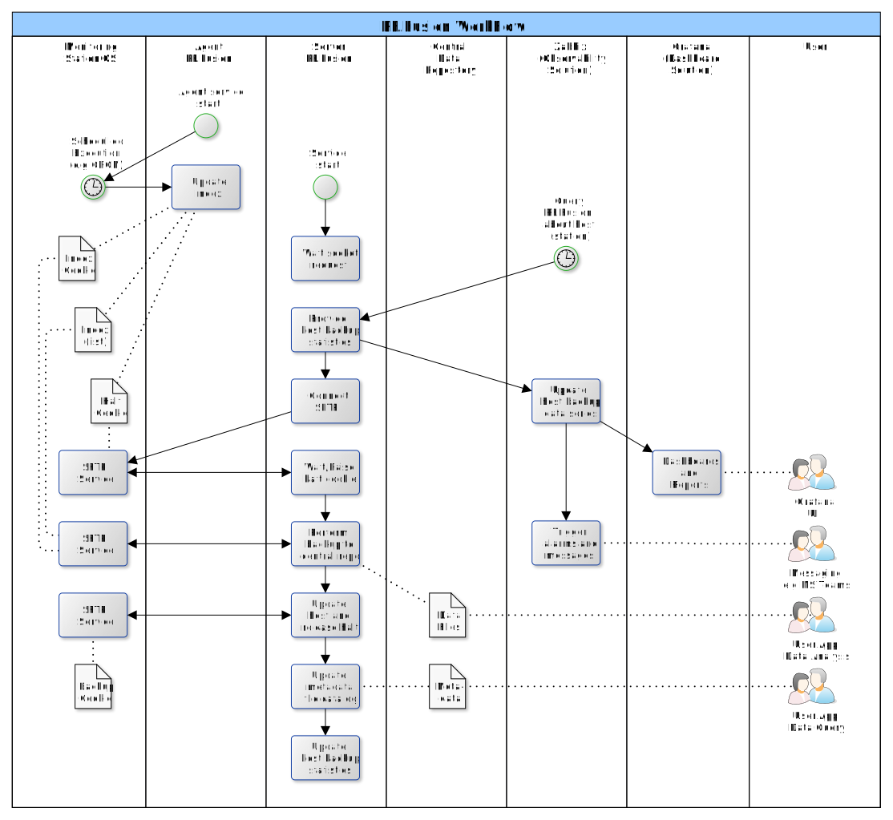
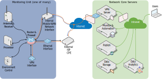

<!-- Improved compatibility of back to top link: See: https://github.com/othneildrew/Best-README-Template/pull/73 -->

<!-- PROJECT SHIELDS -->
<!--
*** based on https://github.com/othneildrew/Best-README-Template
*** Reference links are enclosed in brackets [ ] instead of parentheses ( ).
*** See the bottom of this document for the declaration of the reference variables
*** for contributors-url, forks-url, etc. This is an optional, concise syntax you may use.
*** https://www.markdownguide.org/basic-syntax/#reference-style-links
-->
<!-- TABLE OF CONTENTS -->

  
Table of Contents

  <ol>
    <li><a href="#about-RF.Fusion">About RF.Fusion</a></li>
    <li><a href="#background">Background</a></li>
      <ul>
        <li><a href="#monitoring-unit">Monitoring Unit</a></li>
        <li><a href="#network-server-core">Network Server Core</a></li>
      </ul>
    <li><a href="#bricks-and-blocks">Bricks and Blocks</a></li>
    <ul>
    <li><a href="#openvpn">OpenVPN</a></li>
    <li><a href="#zabbix-and-grafana">Zabbix and Grafana</a></li>
    <li><a href="#nginx">NGINX</a></li>
    <li><a href="#appcataloga">appCataloga</a></li>
    <li><a href="#other">Other</a></li>
    </ul>
    <li><a href="#getting-started">Getting Started</a></li>
    <li><a href="#roadmap">Roadmap</a></li>
    <li><a href="#contributing">Contributing</a></li>
    <li><a href="#license">License</a></li>
    <li><a href="#additional-references">Additional References</a></li>
  </ol>

<!-- ABOUT THE PROJECT -->
# About RF.Fusion

RF.Fusion is an integration framework to manage hardware and data across an Spectrum Monitoring Network.

The framework is composed by a series of modules that can be used together or independently, depending on the needs of the user.

The modules are designed to be used in a distributed network, where each monitoring unit can operate independently, but also communicate with a central server core for data storage, analysis and publication. Although conceived with such network in mind, most of the modules could be easily adapted to suit other needs associated with data collection from any distributed automated sensor network, providing a base for projects such as those related to smart cities and environment monitoring.

General workflow is depicted in the following figure:

Modules were constructed with the idea of maximizing code reuse by employing standard open source tools to perform core tasks and dedicated modules to perform equipment specific data integrations.

(<a href="#indexerd-md-top">back to top</a>)

# Background

To better understand and maybe adapt the modules presented in this repository, it is helpful to understand the general architecture of a spectrum monitoring network, such as presented in the following figure.

The elements in the above diagram may be briefily described as follows:

(<a href="#indexerd-md-top">back to top</a>)

## Monitoring Unit

The network itself can be composed by several monitoring units, up to a few hundred.

Each monitoring unit integrates a series of functional components as follows

- **Antenna & Receiver:** Is the data acquisition front-end, from the RF receiving antennas to the digitizer and DSP units that provides data streams with IF IQ data, spectrum sweeps, demodulated data and alarms. Each equipment may provide a different set of data as output.
- **Processor:** Is a generic data processor running linux or windows. It's the local brain of the monitoring station, responsible to perform data requests to the acquisition front-end, any additional processing for data analysis and tagging. It also manage interfaces and the local data repository.
- **Environment Control:** may be composed of several elements that are accessory to the measurement, such as temperature control, security detectors, cameras, UPS and power supply management, etc.
- **Router, Firewall and Network Interfaces:** may be composed of several elements that interconnect elements within the station and from it to the outside world. Common solutions provide up to 3 interfaces including an ethernet cable, an integrated 4G or 5G modem to connect to to the mobile WAN network and a VPN connection, that allows for a secure communication with the server core

Monitoring units used with RF.Fusion include [CRFS RFeye Node 20-6](https://www.crfs.com/product/receivers/rfeye-node-20-6/); [Celplam CWRMU](https://www.celplan.com/products/test-measurement/cellwirelesssm/); [Rohde&Schwarz UMS300](https://www.rohde-schwarz.com/es/productos/sector-aeroespacial-defensa-seguridad/aplicacion-en-el-exterior/rs-ums300-compact-monitoring-and-location-system_63493-56146.html) and further units integrates by the use of appColeta using VISA/SCPI to access data from spectrum analysers and monitoring receivers from various manufacturers.

(<a href="#indexerd-md-top">back to top</a>)

## Network Server Core

Composed by a series of functional components as follows

- **VPN Server:** Provide secure connection and network integration between the monitoring units and the network core servers
- **Monitor and Automation:** Run services responsible for monitoring the health of the monitoring units, essential network services. Orchestrate the data backup from the monitoring units to the core server data storage. Employs Zabbix and Grafana as core applications
- **Publish:** Run services responsible catalog and publish data for direct user consumption. Employs nginx as a core and additional
- **Data Storage:** Network storage attached to the server core. Provide a shared file space to receive data from the monitoring units, share with users through the publication service and data analytics services.
- **Data Analytics:** Rum services related to the data analysis, either autonomous processing and with user interfaces.

(<a href="#indexerd-md-top">back to top</a>)

# Bricks and Blocks

## OpenVPN
OpenVPN provides a secure communication channel between all elements of the spectrum monitoring network.

The framework provides a set of script to automate the deployment of keys and configuration packages in batch.

It also provides scripts for integration of the OpenVPN server with other services, including DNS and Zabbix Monitoring.

For more information see the detailed description for the [OpenVPN server setup](/src/ovpn/README.md).

(<a href="#indexerd-md-top">back to top</a>)

## Zabbix and Grafana

Zabbix provides the core network monitoring and automation of the spectrum monitoring network equipment.

Grafana provides a rich front-end to Zabbix for the end-users and allows for custom use of forms to access the zabbix database, including additional elements that may be required.

The framework provides a set of Zabbix templates and external check scripts that enable the integration of various equipment and the automatic update of network deployment characteristics, including address based on the GPS data and essential network data.

For more information, see the detailed description for the [Zabbix Service](/src/zabbix/README.md) and [Grafana Service](/src/grafana/README.md)

(<a href="#indexerd-md-top">back to top</a>)

## NGINX

Web server used by Zabbix, as proxy to Grafana and for data publication, enabling users to download data through http service for desktop processing

The framework provides configuration files for both the Zabbix server and the raw data publishing server

For more information, see the detailed description for the [NGINX Server](/src/nginx/README.md)

(<a href="#indexerd-md-top">back to top</a>)

## appCataloga

Include several scripts that perform a recurrent sweep of all servers monitored by Zabbix, and start the backup process.

Backup process includes metadata extraction from raw files and organization of the data repository.

For more information, see the detailed description of [appCataloga service](/src/appCataloga/README.md)

(<a href="#indexerd-md-top">back to top</a>)

## Other

Other components include the webApp for analysis and additional tools under the project repository to be expanded

(<a href="#indexerd-md-top">back to top</a>)

<!-- GETTING STARTED -->
# Getting Started

This initial page provide links to additional pages under the same project with detailed information about the installation of each component.

Currently there is no quick deployment tool and components need to be installed manually or with the aid of indicated scripts.

(<a href="#indexerd-md-top">back to top</a>)

<!-- ROADMAP -->
# Roadmap

* [ ] Create main repository and upload existing data
  * [x] Complete base upload
  * [ ] Upload grafana nginx configuration
  * [ ] Upload nginx zabbix-grafana proxy configuration
* [ ] Start issue list
* [ ] Adapt appCataloga to new architecture
  * [ ] Test file catalog agent
  * [ ] Test integration modes between Zabbix and appCataloga
    * [ ] Use Zabbix external_check to call the backup microservice for a single host and get latest backup data results.
    * [ ] Use Zabbix api to load station list, sweep list getting files, use zabbix trapper item to load data into host.
    

See the [open issues](https://github.com/othneildrew/Best-README-Template/issues) for a full list of proposed features (and known issues).

(<a href="#indexerd-md-top">back to top</a>)

<!-- CONTRIBUTING -->
# Contributing

Contributions are what make the open source community such an amazing place to learn, inspire, and create. Any contributions you make are **greatly appreciated**.

If you have a suggestion that would make this better, please fork the repo and create a pull request. You can also simply open an issue with the tag "enhancement".
Don't forget to give the project a star! Thanks again!

1. Fork the Project
2. Create your Feature Branch (`git checkout -b feature/AmazingFeature`)
3. Commit your Changes (`git commit -m 'Add some AmazingFeature'`)
4. Push to the Branch (`git push origin feature/AmazingFeature`)
5. Open a Pull Request

(<a href="#indexerd-md-top">back to top</a>)

<!-- LICENSE -->
# License

Distributed under the GNU General Public License (GPL), version 3. See [`LICENSE.txt`](.\LICENSE) for more information.

For additional information, please check <https://www.gnu.org/licenses/quick-guide-gplv3.html>

This license model was selected with the idea of enabling collaboration of anyone interested in projects listed within this group.

It is in line with the Brazilian Public Software directives, as published at: <https://softwarepublico.gov.br/social/articles/0004/5936/Manual_do_Ofertante_Temporario_04.10.2016.pdf>

Further reading material can be found at:
- <http://copyfree.org/policy/copyleft>
- <https://opensource.stackexchange.com/questions/9805/can-i-license-my-project-with-an-open-source-license-but-disallow-commercial-use>
- <https://opensource.stackexchange.com/questions/21/whats-the-difference-between-permissive-and-copyleft-licenses/42#42>

(<a href="#indexerd-md-top">back to top</a>)

# Additional References

(<a href="#indexerd-md-top">back to top</a>)

<!-- MARKDOWN LINKS & IMAGES -->
[smn_overview]: https://github.com/FSLobao/RF.Fusion/tree/main/docs/images/general_diagram.svg

