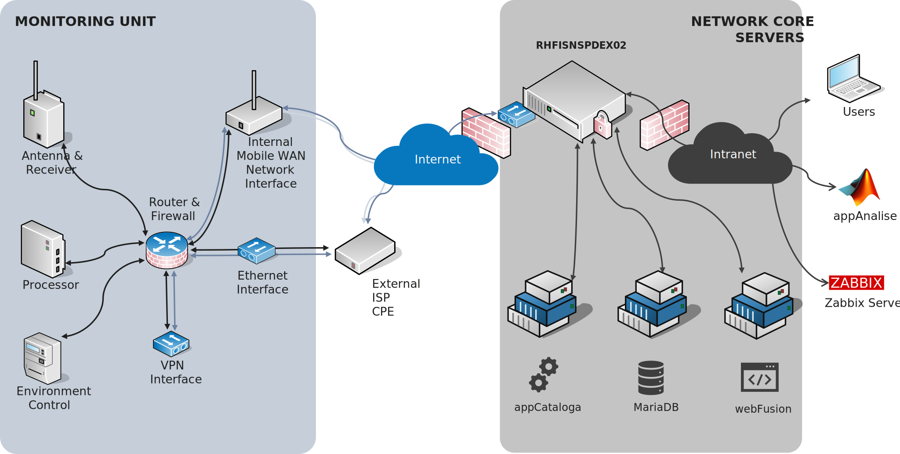

[](https://deepwiki.com/InovaFiscaliza/RF.Fusion)

# RF.Fusion

O RF.Fusion e uma plataforma de integracao para monitoramento de espectro.
Seu objetivo e coletar arquivos gerados por estacoes remotas, processar os
dados de medicao, catalogar espectros em banco e disponibilizar visoes
operacionais e analiticas pela interface web.

## Visao Geral

Em operacao, o fluxo principal do RF.Fusion e:

1. as estacoes remotas geram arquivos de medicao
2. o `appCataloga` descobre, transfere e processa esses arquivos
3. o MariaDB persiste estado operacional, catalogo analitico e resumos
4. o `webfusion` publica consultas, mapas e paineis para o operador

Os modulos centrais sao:

- `appCataloga`: runtime operacional responsavel por descoberta, fila, backup, processamento, publicacao de metadados e manutencao
- `MariaDB`: camada de persistencia com os schemas `BPDATA`, `RFDATA` e `RFFUSION_SUMMARY`
- `webfusion`: interface web para mapa de estacoes, consultas de espectro/arquivos e paineis operacionais

Componentes de apoio como `nginx`, `OpenVPN`, `Zabbix`, `Grafana` e scripts de servico complementam esse nucleo.

O diagrama abaixo resume a arquitetura atual da plataforma:



## Modulos E Arquitetura

### appCataloga

E o nucleo operacional do sistema. Faz o ciclo de vida dos arquivos e das
estacoes:

- cadastro e monitoramento de hosts
- descoberta de arquivos remotos
- backup para o repositorio compartilhado
- processamento local ou via `appAnalise`
- atualizacao dos read models em `RFFUSION_SUMMARY`
- limpeza de artefatos conforme retencao

Documentacao principal:

- [Visao geral do appCataloga](./src/appCataloga/README.md)

### Banco de dados

O projeto usa tres schemas com responsabilidades diferentes:

- `BPDATA`: estado operacional de hosts, filas e historico de arquivos
- `RFDATA`: catalogo analitico de espectros, sites, equipamentos e arquivos
- `RFFUSION_SUMMARY`: tabelas resumidas para consultas rapidas e dashboards

Documentacao principal:

- [Scripts e contratos de banco](./src/mariadb/scripts/DB_INTERCONNECTIONS.md)
- [Schema de resumo](./src/mariadb/scripts/RFFUSION_SUMMARY.md)

### webfusion

E a interface web do RF.Fusion. Centraliza:

- mapa de estacoes e localidades
- consultas de espectro e arquivos
- paineis globais e por host
- algumas acoes operacionais orientadas por fila

Documentacao principal:

- [Visao geral do webfusion](./src/webfusion/README.MD)

## Estrutura Do Repositorio

As pastas mais importantes sao:

```text
RF.Fusion/
├── docs/        # diagramas e material de referencia
├── install/     # scripts de deploy dos containers
├── service/     # inicializacao automatica via systemd
├── src/         # codigo-fonte dos modulos e servicos
├── test/        # suite ativa de testes
├── tools/       # utilitarios pontuais
└── data/        # area de dados do projeto
```

Dentro de `src/`, os subdiretorios principais sao:

- `src/appCataloga/`
- `src/webfusion/`
- `src/mariadb/scripts/`
- `src/nginx/`
- `src/zabbix/`
- `src/grafana/`
- `src/ovpn/`

## Instalacao E Execucao

O caminho suportado hoje e baseado em containers Linux/Podman.

### 1. Implantar o banco MariaDB

Use a documentacao de deploy do container:

- [install/mariaDB/README.md](./install/mariaDB/README.md)

### 2. Implantar o runtime do appCataloga

Use a documentacao de deploy do container:

- [install/appCataloga/README.md](./install/appCataloga/README.md)

### 3. Implantar a interface web

Use a documentacao de deploy do container:

- [install/webserver/README.MD](./install/webserver/README.MD)

### 4. Subir o stack

Quando os containers ja estiverem implantados, a subida automatica pode ser
feita pelo servico systemd descrito em:

- [service/README.md](./service/README.md)

Esse fluxo sobe o ambiente na ordem:

1. montagem do repositorio `/mnt/reposfi`
2. container MariaDB
3. container `appCataloga`
4. container `webfusion`

### 5. Executar testes

Para validar a base ativa:

```bash
cd /RFFusion/test
./test_all.sh
```

Documentacao complementar:

- [test/README.md](./test/README.md)

## Referencias Rapidas

- [Arquitetura e diagramas](./docs/)
- [appCataloga](./src/appCataloga/README.md)
- [webfusion](./src/webfusion/README.MD)
- [Banco de dados](./src/mariadb/scripts/)
- [Deploy de servicos](./service/README.md)

## Licenca

Distribuido sob a GNU General Public License v3.

- [LICENSE](./LICENSE)
