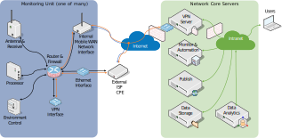

[](https://deepwiki.com/InovaFiscaliza/RF.Fusion)

# RF.Fusion

RF.Fusion is a spectrum-monitoring integration platform built to do three
practical jobs well:

- collect files from remote monitoring stations
- catalog processed spectra and repository artifacts
- expose operational and analytical views through a web interface

At runtime, the project revolves around three main pieces:

- `appCataloga`
- MariaDB with `BPDATA` and `RFDATA`
- `webfusion`

OpenVPN, nginx, Zabbix, Grafana and deployment scripts support that core, but
the day-to-day behavior of the system lives in those three areas.

## What The System Does

In practical terms, the active workflow is:

1. monitoring stations generate raw files
2. `appCataloga` discovers and backs them up into `reposfi`
3. `appCataloga` processes them locally or through `appAnalise`
4. `BPDATA` stores operational state and lifecycle history
5. `RFDATA` stores sites, files, equipment and spectra
6. `webfusion` reads both databases and exposes the operator-facing workflow

This split is intentional:

- `BPDATA` answers operational questions
  - which host is online?
  - which host task is pending?
  - which file failed backup or processing?

- `RFDATA` answers analytical questions
  - where was a spectrum measured?
  - which equipment produced it?
  - which repository file contains it?

## System Context

RF.Fusion was designed for a distributed monitoring environment with remote
stations, central processing, shared storage and browser-based operational
inspection.

If you want one picture that explains the runtime at a glance, start here.

Reading the diagram from left to right:

- remote stations and manual uploads feed the platform
- `appCataloga` orchestrates discovery, backup, processing and cleanup
- `appAnalise` can export final artifacts that RF.Fusion later validates semantically
- MariaDB splits operational state into `BPDATA` and analytical state into `RFDATA`
- `webfusion` queries both worlds and exposes the operator-facing views

The diagrams below are still useful, but they are more infrastructure-oriented.



The current platform-level organization is represented below.


## Main Components

### appCataloga

`appCataloga` is the operational core of RF.Fusion.

It is responsible for:

- host registration and orchestration
- discovery of remote files
- backup to the shared repository
- local processing and `appAnalise`-based processing
- metadata publication
- garbage collection of quarantined artifacts

Main documentation:

- [appCataloga overview](./src/appCataloga/README.md)

### webfusion

`webfusion` is the browser interface.

It currently provides:

- the Brazil-centered station map
- spectrum and file queries
- host and server inspection pages
- manual host-check request creation
- repository-backed downloads, preferably served directly by `nginx`

Main documentation:

- [webfusion module README](./src/webfusion/README.MD)
- [web container README](./install/webserver/README.MD)

### Database Layer

MariaDB is split into the two project databases described above.

Main documentation:

- [MariaDB container README](./install/mariaDB/README.md)
- [database interconnections](./src/mariadb/scripts/DB_INTERCONNECTIONS.md)
- [appCataloga DB layer README](./src/appCataloga/server_volume/usr/local/bin/appCataloga/db/README.md)

## Core Domain Contracts

These are the contracts that matter most when changing code.

### Host vs Site vs Equipment

These are not the same thing.

- `HOST` in `BPDATA` is an operational object
  - connectivity
  - busy state
  - discovery / backup orchestration
  - Zabbix-facing lifecycle

- `DIM_SPECTRUM_SITE` in `RFDATA` is a measurement locality
  - centroid in `GEO_POINT`
  - optional mobile geometry in `GEOGRAPHIC_PATH`
  - administrative geography

- `DIM_SPECTRUM_EQUIPMENT` in `RFDATA` is the receiver identity carried by the payload

This distinction matters because a measurement can exist without a meaningful
`HOST` correlation, especially for mobile or manually imported data.

### BPDATA vs RFDATA

The system uses two databases with different responsibilities.

- `BPDATA`
  - `HOST`
  - `HOST_TASK`
  - `FILE_TASK`
  - `FILE_TASK_HISTORY`

- `RFDATA`
  - site dimensions
  - file dimensions
  - procedure / detector / unit / trace dimensions
  - spectrum equipment
  - `FACT_SPECTRUM`
  - bridge tables

Operational state should not leak into `RFDATA`, and measurement semantics
should not be forced into `BPDATA`.

### HOST_TASK Contract

`HOST_TASK` is treated as durable workflow state, not as an append-only log of
endlessly created rows.

Current contract:

- one logical row per `FK_HOST + NU_TYPE`
- the backend refreshes timestamps, status and filter instead of creating a new row every time
- running tasks are preserved instead of being silently overwritten
- `webfusion` follows the backend queue contract instead of maintaining a second scheduling logic

In practice:

- backend internal tasks such as connection checks and statistics refresh still exist
- the `webfusion` UI only exposes the conventional host-check entrypoint

### FILE_TASK vs FILE_TASK_HISTORY

`FILE_TASK` is transient workflow state.

`FILE_TASK_HISTORY` is the authoritative lifecycle record.

That means:

- `FILE_TASK` can be created, updated, suspended, resumed or deleted
- `FILE_TASK_HISTORY` is the record operators and garbage collection reason about
- the garbage collector only marks deletion for the artifact currently referenced by `FILE_TASK_HISTORY`

### Repository Artifact Contract

The shared repository under `/mnt/reposfi` is part of the workflow contract.

Current artifact semantics:

- canonical errored artifacts live under `trash/`
- superseded source artifacts live under `trash/resolved_files/`
- successful exported artifacts live in their final repository path

This distinction matters for appAnalise flows:

- when `appAnalise` exports a final artifact and RF.Fusion later rejects it semantically,
  the exported artifact becomes the error artifact
- the original source file becomes a resolved input and moves to `resolved_files`

### appAnalise Spectrum Contract

The `appAnalise` path is no longer modeled as "one site per file".

Current behavior:

- site resolution is per spectrum
- equipment comes from the payload receiver per spectrum
- bad spectra are discarded selectively when possible
- the whole file only fails when no valid spectra remain
- `DIM_SPECTRUM_FILE` remains the file artifact dimension
- `FACT_SPECTRUM` carries locality, equipment and time
- `BRIDGE_SPECTRUM_FILE` links both worlds

This is what allows mixed or aggregated payloads to be persisted honestly.

## Repository Layout

The current top-level structure is:

```text
RF.Fusion/
├── data/            # project data area
├── docs/            # diagrams and reference docs
├── install/         # deployment material
├── src/             # application and service source code
├── test/            # active validation suite
└── LICENSE
```

Important subtrees:

- `install/appCataloga`
- `install/mariaDB`
- `install/webserver`
- `src/appCataloga`
- `src/webfusion`
- `src/mariadb/scripts`
- `test/`

## Getting Started

If you are new to the repository, this order works well:

1. read this `README.md`
2. read [appCataloga overview](./src/appCataloga/README.md)
3. read [webfusion README](./src/webfusion/README.MD)
4. read the install docs for the container you want to deploy
5. run the active tests before making structural changes

## Installation And Deployment

The repository is currently documented around the Linux/Podman deployment flow.

Main entry points:

- [appCataloga container](./install/appCataloga/README.md)
- [MariaDB container](./install/mariaDB/README.md)
- [webfusion/webserver container](./install/webserver/README.MD)

Typical deployment order:

1. deploy MariaDB
2. deploy the `appCataloga` runtime container
3. deploy the web container
4. start the `appCataloga` workers inside the mounted runtime

### appCataloga runtime

The `appCataloga` container provides the runtime environment, not the whole
orchestration by itself.

Once the container is available, the practical worker scripts live under:

- [appCataloga runtime scripts](./src/appCataloga/server_volume/usr/local/bin/appCataloga)

Useful operational helpers:

- [tool_start_all.sh](./src/appCataloga/server_volume/usr/local/bin/appCataloga/tool_start_all.sh)
- [tool_status_all.sh](./src/appCataloga/server_volume/usr/local/bin/appCataloga/tool_status_all.sh)
- [tool_stop_all.sh](./src/appCataloga/server_volume/usr/local/bin/appCataloga/tool_stop_all.sh)

### MariaDB runtime

MariaDB deployment initializes the project schemas:

- `BPDATA` from `createProcessingDB-v9.sql`
- `RFDATA` from `createMeasureDB-v5.sql`

The schema scripts live under:

- [mariadb scripts](./src/mariadb/scripts)

### webfusion runtime

The web container publishes `webfusion` behind `nginx` and `waitress`.

It is the preferred entry point for:

- map and host inspection
- spectrum and file queries
- manual host-check creation
- repository-backed downloads

## How To Run The Main Pieces

There is more than one valid way to run the project, but the practical paths
today are these:

### Run the active test suite

```bash
cd /RFFusion/test
pytest tests -q
```

More details:

- [test suite README](./test/README.md)

### Run the appCataloga worker stack

From inside the prepared `appCataloga` runtime:

```bash
cd /RFFusion/src/appCataloga/server_volume/usr/local/bin/appCataloga
./tool_start_all.sh
```

Check status:

```bash
./tool_status_all.sh
```

Stop:

```bash
./tool_stop_all.sh
```

### Run the web layer

The supported path today is the documented web container deployment:

- [webfusion/webserver container](./install/webserver/README.MD)

### Run metadata publication

The metadata publication worker is part of the `appCataloga` stack:

- [appCataloga_pub_metadata.py](./src/appCataloga/server_volume/usr/local/bin/appCataloga/appCataloga_pub_metadata.py)

It exports Parquet snapshots from `RFDATA` for downstream consumption.

## Testing

The active suite lives under `test/`.

Current entry points include:

- `test/tests/shared`
- `test/tests/stations`
- `test/tests/workers`
- `test/tests/db`
- `test/tests/webfusion`

Typical execution:

```bash
cd /RFFusion/test
pytest tests -q
```

## Good Practices

These are the project practices that currently matter most.

- Keep `BPDATA` operational and `RFDATA` analytical.
- Treat `HOST`, `SITE` and `EQUIPMENT` as different concepts.
- Do not reintroduce "one site per file" assumptions into the appAnalise path.
- Prefer updating durable workflow state instead of creating new queue rows unnecessarily.
- Treat `FILE_TASK_HISTORY` as the source of truth for lifecycle inspection.
- Preserve the artifact contract between final path, `trash/` and `trash/resolved_files/`.
- When changing queue behavior, make `webfusion` follow the backend contract instead of inventing a second one.
- When changing worker behavior, update tests and README together.
- Prefer the active workers, handlers and tests over old assumptions from historical code.

## Current State

The repository is active and functional, but it still mixes mature operational
code with inherited historical structure and naming.

In practical terms:

- `appCataloga` is the strongest and most actively maintained part of the system
- the worker and garbage-collection contracts are much more explicit than before
- `webfusion` is no longer just a thin query page; it is a real operational UI
- some naming still reflects older stages of the project and may lag behind current behavior

When in doubt:

- trust the active workers over archived assumptions
- trust the current database handlers over old queue logic
- trust the active tests and refreshed READMEs over stale historical context

## Contributing

Contributions are welcome, especially when they improve:

- operational robustness
- documentation quality
- test coverage
- schema clarity
- maintainability of the worker pipeline

## License

Distributed under the GNU General Public License (GPL), version 3.

See:

- [LICENSE](./LICENSE)
