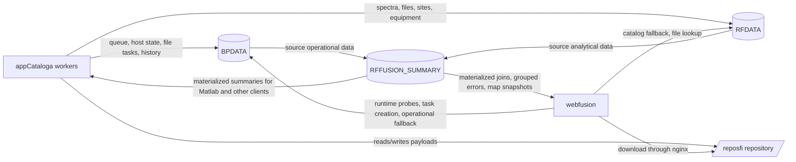
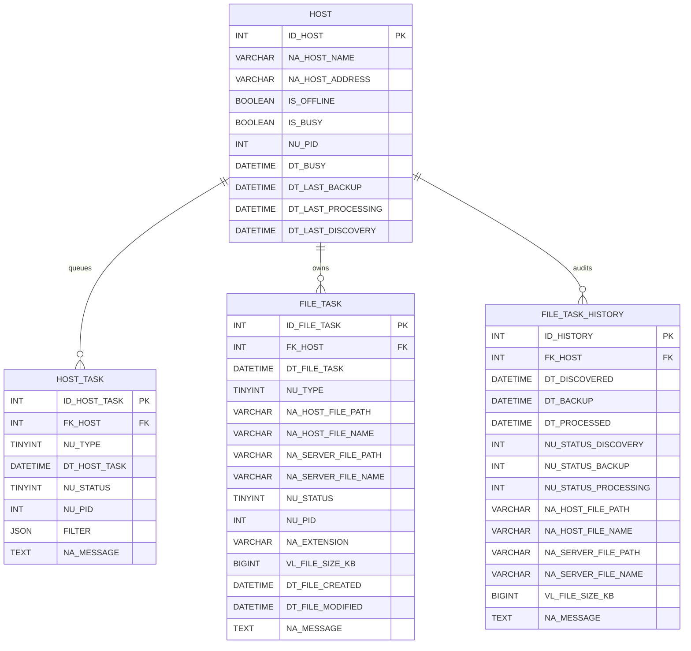
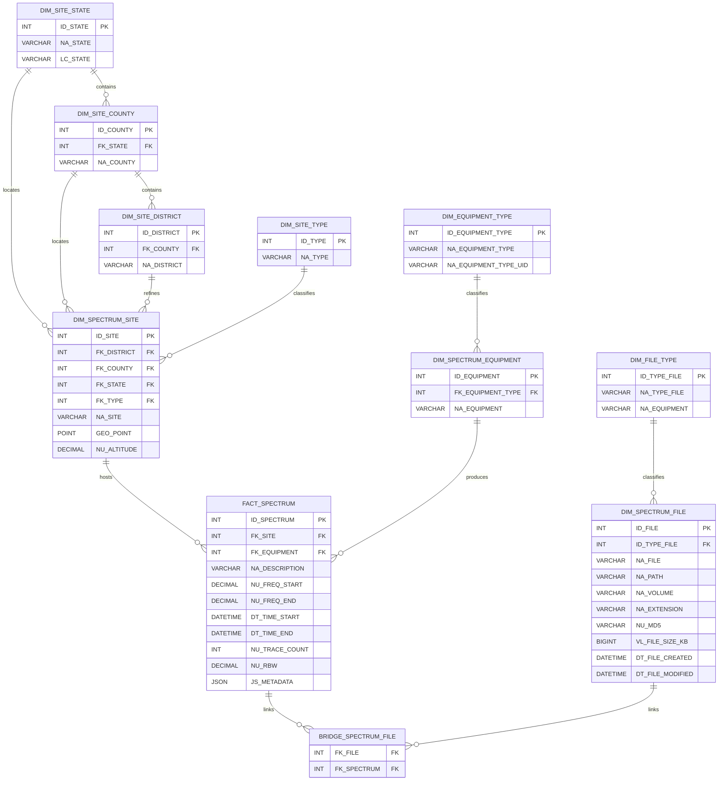
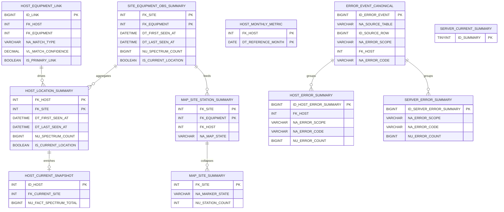

# RF.Fusion Database Interconnections

This document summarizes the practical relationships between the three main
project databases:

- `BPDATA`
- `RFDATA`
- `RFFUSION_SUMMARY`

It focuses on the tables that are most relevant to `appCataloga` and
`webfusion`.

## 1. System-Level Data Flow

At the project level, the databases are complementary rather than directly
linked by cross-database foreign keys.

## 2. Important Architectural Note

There is currently **no direct foreign key bridge between `BPDATA`,
`RFDATA` and `RFFUSION_SUMMARY`**.

The interconnection between both databases is mostly **application-level**:

- `appCataloga` discovers, backs up, and processes files
- `BPDATA` stores queue and operational state
- `RFDATA` stores measurement catalog data and repository file metadata
- `webfusion` reads both worlds and reconciles them when needed
- `RFFUSION_SUMMARY` can materialize that reconciliation into stable read
  models

This is why some integrations, especially station-to-host correlation, still
depend on naming heuristics rather than explicit relational keys.

## 3. BPDATA Core Relationships

`BPDATA` is the operational database for hosts and pipeline state.

### BPDATA Role

This database answers operational questions such as:

- which hosts are online, offline, or busy
- which host tasks are pending, running, or failed
- which file tasks are pending backup or processing
- what happened to a given file during discovery, backup, and processing

## 4. RFDATA Core Relationships

`RFDATA` is the measurement and repository catalog database.

### RFDATA Role

This database answers catalog and analysis questions such as:

- where stations are geographically located
- which equipment produced the measurement
- which spectra belong to a site or equipment
- which repository file is linked to one or more spectra

## 5. RFFUSION_SUMMARY Core Relationships

`RFFUSION_SUMMARY` is the materialized read-model database for the heaviest
cross-database views.

### RFFUSION_SUMMARY Role

This database answers consumer-oriented questions such as:

- which host is currently associated with one equipment
- which locality is current or historical for a host
- which marker state the map should render for a site
- which grouped backup and processing errors dominate the environment
- which server-wide metrics should be available without repeated scans over
  `FILE_TASK_HISTORY` and `FACT_SPECTRUM`

## 5. Practical Interconnection Points Between BPDATA and RFDATA

Even without SQL foreign keys across databases, there are clear business-level
intersections:

### 5.1 appCataloga pipeline

- `BPDATA.FILE_TASK` and `BPDATA.FILE_TASK_HISTORY` track operational progress
- `RFDATA.DIM_SPECTRUM_FILE` stores the repository-side canonical file record
- `RFDATA.FACT_SPECTRUM` and `RFDATA.BRIDGE_SPECTRUM_FILE` connect spectra to
  files

### 5.2 webfusion map

- `RFDATA.DIM_SPECTRUM_SITE` provides coordinates
- `RFDATA.FACT_SPECTRUM` and `DIM_SPECTRUM_EQUIPMENT` provide site/equipment
  context
- `BPDATA.HOST` provides online/offline and host identity
- host resolution is inferred by matching equipment and host names

### 5.3 downloads

- `RFDATA.DIM_SPECTRUM_FILE` provides `NA_PATH`, `NA_FILE`, and `NA_VOLUME`
- the web layer maps those records to the repository mount and serves the file

## 6. What Is Strongly Modeled vs. Heuristic

Strongly modeled:

- host -> host_task
- host -> file_task
- host -> file_task_history
- site -> spectrum
- equipment -> spectrum
- file <-> spectrum

Still heuristic:

- site -> host
- equipment -> host
- operational correlation between a `BPDATA` file task and the final `RFDATA`
  spectrum/file catalog without an explicit shared foreign key

## 7. Recommended Usage of This Diagram

This document is meant to support:

- onboarding
- schema discussions
- future webfusion modules
- operational reasoning around `appCataloga`

It is intentionally focused on the tables that shape the system behavior today,
not on an exhaustive dump of every dimension table.
